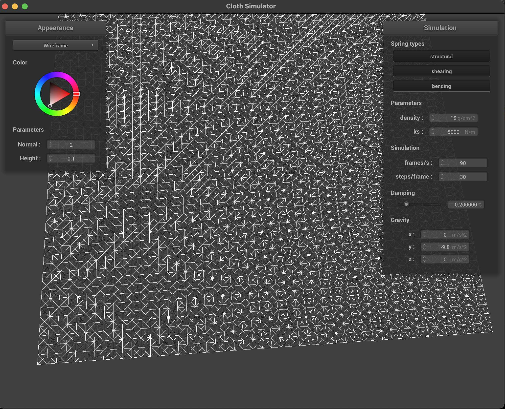

# cs284a_hw4_webpage

## Project Overview

## Part 1: Masses and springs

### Screenshots

Below are some screenshots rendered from pinned2.json file which clearly shows the structure of point masses and springs. We can cearly see the different types of springs (structural and bending constrains are totally overlapped. ) and point masses. 

### Comparison Between different Constraintes

According to the definition of the three types of the constraints, we can see that the normal one (with all three constraints) have both the diagonal springs and the one which is parallel to the x or y axis. However, we can only see the diagonal springs with the shearing constraints only. And we can see the diagonal springs are moved without shearing constraints. The two left constraints (structural, bending) both depict related springs between point masses that locate nearby or 2 distance away from each other along axis. 

Type  | Picture
:---: | :---: 
With All | 
Only Shearing |  
Without Shearing |  

## Part 2: Simulation via numerical integration

### Experiment
In this section, we conduct experiment on changing the parameters and show the corresponding simulation results. 

#### Change the spring constant *ks*
ks=100 | ks=5000 | ks=50000
:---: | :---: | :---:
 |  |  

We can see from the figure above that the balance point of the cloth collapse is getting lower as the constant *ks* increases. This is caused by the fact that the spring force to support the cloth will increase when the constant *ks* increases. Therefore, when the constant decreases, the cloth will collapse and fall down to a lower balance point. 

#### Change *density*
density=1 | density=1500
:---: | :---:
 |  

Similar to changing the spring constant, we can see the balance point get lower as *density* increases. The mass of a point mass increase as the density increases. Therefore, the external force *F=m*a* will increase as *m* (mass) increases, which produce the similar results as *ks* increases (the internal force by the spring increases).

#### Change *damping*
Changing damping does not affect the force. Therefore, the balance point of the cloth (final real estate status) will not change. We can see from our ***simulate*** function that the parameter *damping* only changes the position update process. To be more specific, *damping* affects the weight of the difference between a pointmass's current position and last poisiton. The *damping* simluate the loss of energy. Therefore, larger *damping* will result in slower simulation and more stable final state. And smaller *damping* results in faster swing but less stable final state (need more time to converge to a immobile state.) 

The extreme case are interesting. We will find the cloth keep swinging back and forth when we set *damping=0*, which means there are no energy loss due to factors such as friction. This is straightforward because the sum of Kinetic and Potential Energy will remain a constant in the whole process. 

#### Screenshot: *pinned4.json*
Below are the final state of the rendered *pinned4.json* file. (default parameter)

## Part 3: Handling collisions with other objects

### Sphere
Below are the screenshots of the final state of the rendered *sphere.json* file. (ks=500, 5000, 50000)

ks=500 | ks=5000 | ks=50000
:---: | :---: | :---:
 |  |  

We can see from the pictures above that the cloth spreads out at a wider angle after reaching the final state. Because the closth can support itself better when *ks* increases (lareger force provided by spring). Therefore, the pointmass on the two side (not adhere to the shpere) will balance itself at a larger angle. 

### Plane
Below are the screenshots of the shaded cloth lying at the plane. 

## Part 4: Handling self-collisions

### Screenshots

The figure below shows the process of the falling and folding of the cloth, starting from an initial state and ending at a restful state at ground. We can see the cloth folds itself finally.

1 | 2 | 3 | 4
:---: | :---: | :---: | :---:
 |  |  | 

### Changing *ks*

The figure below shows the rendered screenshots of the final state of the cloth with different spring constant *ks* values. We can see the cloth falls itself in a more loose state as *ks* decreases. This is because the supportive force from the spring decreases as *ks* decreases, leading to less supportive force and looser state. On the contrary, the cloth will support itself in a higher height with larger *ks* values.

ks=50 | ks=500 | ks=5000 | ks=50000
:---: | :---: | :---: | :---:
 |  |  | 

### Changing *density*

The figure below shows the rendered screenshots of the final state of the cloth with different *density*. We can see that the cloth folds itself in a looser final state with larger densities. Similar to before, the external force will increase as *density* increases. Therefore, the cloth will be forced to a more flat state with less internal force (spring) accordingly. 

density=1 | density=15 | density=150
:---: | :---: | :---:
 |  | 

## Part 5: Shaders
### Explain in your own words what is a shader program and how vertex and fragment shaders work together to create lighting and material effects.

### Explain the Blinn-Phong shading model in your own words. Show a screenshot of your Blinn-Phong shader outputting only the ambient component, a screen shot only outputting the diffuse component, a screen shot only outputting the specular component, and one using the entire Blinn-Phong model.
Explanation:

Only Ambient Component | Only Diffuse Component
:---: | :---: | :---: | :---:
 | 

Only Specular Component | Entire Blinn-Phong Model
:---: | :---:
 | 
### Show a screenshot of your texture mapping shader using your own custom texture by modifying the textures in /textures/.
texture mapping shader on the sphere | texture mapping shader on the cloth 
:---: | :---: 
 |  

### Show a screenshot of bump mapping on the cloth and on the sphere. Show a screenshot of displacement mapping on the sphere. Use the same texture for both renders. You can either provide your own texture or use one of the ones in the textures directory, BUT choose one that's not the default texture_2.png. Compare the two approaches and resulting renders in your own words. Compare how your the two shaders react to the sphere by changing the sphere mesh's coarseness by using -o 16 -a 16 and then -o 128 -a 128.
bump mapping on the sphere | bump mapping on the cloth 
:---: | :---: 
 |  

displacement mapping on the sphere | displacement mapping on the cloth 
:---: | :---: 
 |  

origin | -o 16 -a 16 | -o 16 -a 16
:---: | :---: | :---:
 |  | 

origin | -o 16 -a 16 | -o 16 -a 16
:---: | :---: | :---:
 |  | 

### Show a screenshot of your mirror shader on the cloth and on the sphere.
mirror shader on the sphere | mirror shader on the cloth 
:---: | :---: 
 |  
